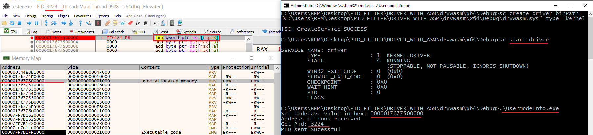
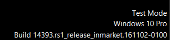

# Windows x64 driver for specific process system call redirection

This software was created with the following functionality in mind: 

In the context of analysing process behaviour (either in malware analysis, or system forensics), the debugged proces often tries to conceal the use of Windows API's through different means like:

- Code decription at run-time
- Direct system calls
- Control flow obfuscation
- Different types of dynamic/reflective DLL loading

Also the size and depth of a control flow graph makes it hard for the analyst to quickly identify usefull portions of the code, and thus many VM revert operation are sometines necessary. 

We aknowlegde the existance of multiple software/libraries for dynamic binary instrumentation, API hooking and system call hooking, but the software we propose makes it possible to:
-  **Trigger an user mode breakpoint in an arbitray location (chosen by the user) after every system call (from ntdll.dll) made by the debugged process**

The process is as follows:

1. Attach to, or start the desired process under a debugger and pause it
2. Allocate a region of memory in the process space, with RWX permision
3. Edit the first bytes in the memory zone to form the instruction ```jmp [rsp-0x8]```
4. Set a breakpoint to the instruction
5. Start the driver *(drvwasm.sys)* and the Userspace application *(UsermodeInfo.exe)*
6. Provide the PID of the process being debuggd and the address of the ```jmp``` instruction

**Now every system call made by the respective process will be redirected to the address specified, and the breakpoint wil be hit.**

## Static demo of the commands and custom breakpoint:


To restore the normal flow of th system calls, quit the Usermodeinfo.exe app and use the command ```sc stop driver```

## GIF demo of the functionality

*Description*: In a test environment, the sample being debugged has only one breakpoint set, in the user allocated memory at the instruction ```jmp [rsp-0x8]```. When the execution flow traverses *VirtualAlloc* --> *NtVirtualAlloc*, after the **syscall** instruction the breakpoint is automaticall hit (the syscall return address is being redirected). Moreover, the syscall is executed correctly (the value returned in RAX register is the new memory address)


## LIMITATIONS (IMPORTANT)
1. Need to disable Windows Driver Signing ```bcdedit /set testsigning on```
2. Disable PatchGuard ```bcdedit /set nointegritychecks on```
3. **The application works only for x64 processes**
4. The application works for any multi-threaded program but the **virtual machine needs to be configured with 1 virtual processor with 1 core**

## Compilation and usage
The repository includes the files needed to run the app (**drvwasm.sys and UsermodeInfo.exe** (PID_FILTER\DRIVER_WITH_ASM\drvwasm\x64\Debug)

For modifying and compilation at leas Visual Studio 2019 is rewuired, in conjunction with the Windows Driver Kit (WDK) package.
### Tested on:


### Other remarks
Source code modification imply practical knowledge in Windows Internals, C, assembly language and reverse engineering.

There may be unknown interactions between the hypervizor and application, in a virtual machine.